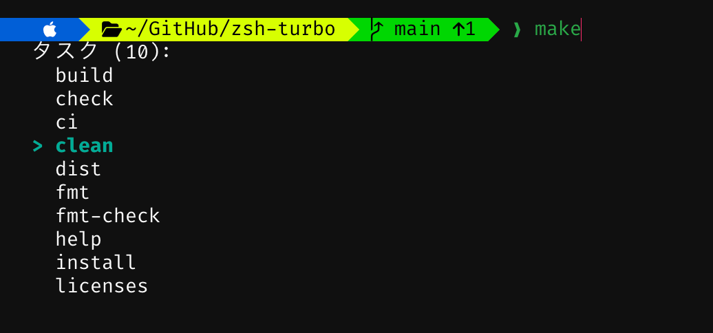

<p align="center">
  
</p>

<h1 align="center">zsh-turbo</h1>

<p align="center">
  プロンプト、入力候補、ハイライト、補完をまとめた Rust 製 zsh 拡張
</p>

<!-- standard:badges:start -->
<h3 align="center">対応プラットフォーム</h3>

<p align="center">
  
  
</p>

<p align="center">
  <a href="https://github.com/owayo/zsh-turbo/actions/workflows/ci.yml"></a>
  <a href="https://github.com/owayo/zsh-turbo/releases/latest"></a>
  <a href="LICENSE"></a>
</p>

<p align="center">
  <a href="README.md">English</a> |
  <a href="README.ja.md">日本語</a>
</p>
<!-- standard:badges:end -->

---

プロンプト描画、入力候補、シンタックスハイライト、補完スタイリングを 1 つのバイナリにまとめています。zsh から呼び出して使います。


## 機能

- **4つのプロンプトスタイル**: Lean、Classic（パワーライン）、Rainbow、Pure。フォントレベルは4段階から選択可能
- **30以上のセグメント**: dir, git, virtualenv, kubecontext, aws, gcloud, terraform, docker, direnv, nix_shell, ssh, 各種言語バージョン, load, battery, disk_usage, ram, vi_mode, proxy, cpu_arch, root_indicator, dir_writable, ip 等
- **カスタムコマンドセグメント**: TUI または TOML で任意のセグメントを定義
- **並列セグメント実行**: `std::thread::scope` で全セグメントを同時実行
- **非同期オートサジェスト**: 履歴ベース（prefix / substring / fuzzy 戦略）
- **シンタックスハイライト**: コマンド、代入語、fd 複製（`2>&1`）を含むリダイレクト、パス、シェルのエスケープを考慮した glob、文字列、zsh 特殊パラメータを含む変数、改行によるコマンド区切りに対応
- **`$PATH` に沿った判定**: 空の要素を zsh と同じくカレントディレクトリとして扱い、その中の実行可能ファイルをコマンドとして認識
- **Transient プロンプト**: コマンド実行後に前のプロンプトを簡略化
- **Semantic Prompt Marker**: iTerm2 3.7 以上と Warp 向けに OSC 133 prompt marker を出力し、右プロンプトと継続プロンプト（`PS2`）の範囲も端末へ伝達
- **堅牢な zsh 連携**: 初期化、ウィジェット、`compinit` は `SH_GLOB` や `NO_UNSET` などのユーザシェルオプション下でも動作し、zsh バッファ由来の CLI 値は `-` 始まりも受け付ける
- **安全なプロンプト出力**: セグメント文字列の zsh プロンプト展開を防ぎ、端末制御文字を置換
- **対話型設定 TUI**: 全設定を編集できるタブ式エディタ（Prompt / Segments / Git / Suggest / Style / Custom / Shell）とライブプレビュー
- **`zsh-turbo install-font`**: MesloLGS NF を OS のユーザフォントディレクトリへインストール
- **`zsh-turbo font`**: フォントと Ghostty/cmux のリガチャ設定を対話形式で選択
- **`zsh-turbo doctor`**: ターミナル・フォント・ツール・設定の診断
- **補完スタイリング**: 大小文字無視、グループ化、キャッシュ、色分け、外部補完関数ディレクトリの追加

- **CLI 補完の登録**: TUI の「補完」で任意の CLI を追加し、ヘルプ・生成コマンド・補完ファイルから候補を作成。登録済み CLI は選択して Backspace（⌫）または `d` を2回押すと削除できます。バイナリ更新時はバックグラウンドで再構築し、Tab はキャッシュを使います。[設定方法](docs/configuration.ja.md#cli-補完の登録)

## 動作環境

- **OS**: macOS、Linux
- **シェル**: zsh 5.4 以上
- **Rust**: 1.98 以上（ソースからビルドする場合、edition 2024。検証用のバージョンは `mise.toml` で固定）

## ターミナルのフォント設定

既定の `unicode` と `ascii` には Nerd Font は不要です。`powerline` と `nerd` は追加のグリフを使います。`zsh-turbo configure` の **Prompt → Font level** でレベルを選んでください。`zsh-turbo font`（**Shell → 端末フォント設定** からも起動可能）では端末の既定フォント、MesloLGS NF、インストール済みのフォントから選べます。MesloLGS NF は Nerd Font のアイコンに適していますが、プログラミング用リガチャはありません。`!=`・`=>`・`->` などを結合表示したい場合は、対応フォントを選んでください。`zsh-turbo install-font` は MesloLGS NF をインストールしますが、端末のフォント設定は変更しません。

| ターミナル | `powerline` / `nerd` 用のフォント設定 |
|---|---|
| [Ghostty 1.2 以降](https://ghostty.org/docs/config) | Nerd Font の記号を内蔵しており、通常はフォント変更不要です。ウィザードでフォントと `font-feature = +calt` / `font-feature = +liga` を設定ファイルへ書けます。変更後は設定を再読み込みしてください。 |
| [cmux](https://github.com/manaflow-ai/cmux/issues/3518) | ウィザードは単体 Ghostty とは別の `~/Library/Application Support/com.cmuxterm.app/config.ghostty` を対象にします。変更後は cmux を再起動してください。 |
| [macOS 標準ターミナル](https://support.apple.com/ja-jp/guide/terminal/trmltxt/mac) | ウィザードで選んだフォントを、使用中のプロファイルの **ターミナル → 設定 → プロファイル → テキスト → フォント → 変更** から指定します。 |
| [iTerm2](https://iterm2.com/documentation-preferences-profiles-text.html) | ウィザードで選んだフォントを、使用中のプロファイルの **Settings → Profiles → Text → Font** で指定します。**Use Non-ASCII Font** が有効ならそちらも設定します。 |

Ghostty と cmux のウィザードではリガチャを「既定」「有効（`+calt`、`+liga`）」「無効（`-calt`、`-liga`）」から選べます。書き込み前に追加内容を表示し、他の設定を保ったまま変更します。既存ファイルを置き換えるときはバックアップを作成します。選んだフォントが対応していない機能は見た目に反映されません。

フォントを変更したら新しいターミナルウィンドウを開いてください。アイコンがまだ `?` や四角になる場合は、`zsh-turbo doctor` でサンプル文字を確認できます。

## インストール

<!-- standard:install:start -->
### Homebrew (macOS/Linux)

```bash
brew install owayo/zsh-turbo/zsh-turbo
```

### Cargo

Rust 1.98 以上が必要です。

```bash
cargo install --git https://github.com/owayo/zsh-turbo --locked
```

### GitHub Releases から

[Releases](https://github.com/owayo/zsh-turbo/releases/latest) から自分の環境のアーカイブを取得して展開し、`zsh-turbo` を `PATH` の通った場所に置きます。各リリースには、取得したファイルを確かめるための `SHA256SUMS` も添付しています。

| プラットフォーム | ファイル |
|---|---|
| Linux (x86_64) | `zsh-turbo-x86_64-unknown-linux-gnu.tar.gz` |
| Linux (ARM64) | `zsh-turbo-aarch64-unknown-linux-gnu.tar.gz` |
| macOS (Intel) | `zsh-turbo-x86_64-apple-darwin.tar.gz` |
| macOS (Apple Silicon) | `zsh-turbo-aarch64-apple-darwin.tar.gz` |

macOS でブラウザから取得した場合は、実行の前に隔離属性を外します: `xattr -d com.apple.quarantine zsh-turbo`。

### ソースから

[mise](https://mise.jdx.dev/) が必要です (Rust のツールチェーンは `mise.toml` で固定しています)。

```bash
git clone https://github.com/owayo/zsh-turbo.git
cd zsh-turbo
make install
```

`make install` は `/usr/local/bin` に入れます。場所を変えるときは `INSTALL_PATH` を指定します (例: `make install INSTALL_PATH="$HOME/.local/bin"`)。
<!-- standard:install:end -->


## 使い方

```bash
# 対話型設定 TUI
zsh-turbo configure

# ~/.zshrc に追加
eval "$(zsh-turbo init)"
```

[zsh-completions](https://github.com/zsh-users/zsh-completions) の補完定義を使う例です。まず一度リポジトリを取得します。

```bash
git clone https://github.com/zsh-users/zsh-completions.git "$HOME/.zsh/zsh-completions"
```

`~/.zshrc` に補完定義がある `src` ディレクトリを指定し、zsh-turbo を初期化します。複数の補完ディレクトリは `:` 区切りで指定できます。

```bash
export ZSH_TURBO_COMPLETION_DIRS="$HOME/.zsh/zsh-completions/src"
eval "$(zsh-turbo init)"
```

端末の shell integration は iTerm2 3.7 以上と Warp で自動的に有効になります。OSC 133 marker でプロンプト範囲を囲むため、端末側のコマンド範囲抽出で左プロンプト、右プロンプト、継続プロンプトを除外できます。無効化する場合は初期化前に `ZSH_TURBO_TERM_SHELL_INTEGRATION=0`、強制有効化する場合は `1` を設定してください。

## プロンプトスタイル

| スタイル | 説明                                                   |
| -------- | ------------------------------------------------------ |
| Lean     | 背景色なし、ミニマル                                   |
| Classic  | Powerline セパレータ + 背景色付きセグメント            |
| Rainbow  | セグメントごとにカラーパレットを巡回                   |
| Pure     | ディレクトリ + git のみのミニマル構成                   |

`zsh-turbo configure` の **配色 → Rainbow の配色** で、青系・緑系・オーシャン・サンセット・パステル・モノクロなど14種類を選べます。**プロンプト → コマンド入力位置** では、同じ行／次の行を切り替えられます。配色は隣接するブロックの色相・明暗に差をつけ、文字を読みやすく調整しています。**配色 → Rainbow のブロック** では OS・ディレクトリ・Git・カスタムの各ブロックを選び、文字色と背景色を256色パレットや RGB 値で個別指定できます。並べ替えや配色セットの変更後も個別色は保持され、プレビューにも反映されます。色選択中も上部に全ブロックのプレビューが表示され、選択中の色や RGB 入力が即座に反映されます。**プロンプト → プロンプト間の空行** では、Enter 後の間隔を0〜10行で指定できます。`S` で保存、`Esc` で終了します。未保存の変更を破棄して終了する場合は、もう一度 `Esc` を押してください。

## キーバインド

| キー        | 動作                         |
| ----------- | ---------------------------- |
| 右矢印      | サジェストをパスの一階層または次の単語まで受け入れ |
| Alt+F       | 1単語を受け入れ              |
| Ctrl+右矢印 | 1単語を受け入れ              |
| 上矢印      | 履歴検索（prefix）           |
| 下矢印      | 表示中の一覧（タスク・コマンド・ファイル）を選択。初期位置は薄い候補に対応する項目（なければ先頭）。選択中は打った文字で絞り込み。一覧がなければ履歴検索（prefix） |
| Ctrl+R      | 履歴候補の一覧（曖昧検索）   |
| Tab         | サジェスト全体を受け入れ（候補がないときは通常の補完） |

空欄から上矢印を押すと全履歴をさかのぼり、下矢印で新しい履歴から元の空欄まで戻れます。入力済みの場合は、検索開始時の先頭文字列を維持して上下にたどります。入力を編集すると新しい検索を始めます。非同期の候補表示や色付けでは検索条件は変わりません。

サジェストはカーソルがバッファ末尾にある間だけ表示・受理されます。カーソルを既存文字列内へ移動すると ghost 表示を消し、末尾へ戻ると有効な候補を再表示します。
たとえば `ls -l` に `/path/to/hoge/fuga` が表示されたとき、右矢印を押すたびに `/path/`、`/path/to/`、`/path/to/hoge/` の順に採用できます。すでに `/path` を入力していた場合は、1回で `/to/` を採用し、入力は `/path/to/` になります。Tab は候補全体を採用します。これらのキーと Alt+F・Ctrl+右矢印の動作は `zsh-turbo configure` の「入力候補」で個別に変更できます。変更後はシェルを再起動してください。

一致度が同程度の候補は使用頻度、新しさの順に並べます。`Ctrl+R` は入力中の文字列から履歴候補を検索し、空欄なら全履歴を対象にします。上下キー・Tab で選び、Enter で入力欄に戻し、もう一度 Enter で実行します。Esc / Ctrl+C で取り消すと元の入力とカーソル位置に戻ります。候補数は「入力候補 → 候補の最大数」で指定でき、既定は10件です。

履歴全体で前方一致を部分一致・曖昧一致より優先します。追記途中の最終行と複数行コマンドの断片は、64 KiB の読み取り境界にあるものも候補から除外します。表示する上位候補だけを選び、全候補の並べ替えを省いています。

候補表示と Ctrl+R は、コマンドを実行したディレクトリごとの履歴を使います。他のディレクトリのコマンドや、実行場所が不明な従来の共通履歴は混ぜません。↑↓ の通常の履歴移動は共通履歴を使います。導入後にそのディレクトリで実行したコマンドから候補が蓄積されます。記録先は `${XDG_STATE_HOME:-~/.local/state}/zsh-turbo/directory-history/` で、`[suggest]` の `record_directory_history = false` で新しい記録を止められます。[保存内容と削除方法](docs/configuration.ja.md#ディレクトリごとの履歴)

カレントディレクトリのタスクは履歴候補より優先します。`make` と入力した時点で Makefile のターゲット一覧を入力欄の下に表示し、`just`・`task` も同様にレシピやタスクを表示します。サブコマンド経由でスクリプトを実行するコマンドは、`npm run`・`pnpm run`・`bun run`・`yarn run`・`uv run`・`deno task`・`mise run` まで入力した時点でスクリプトやタスクを表示します。`uv` や `npm` のようにコマンド名だけを入力したときは、そのコマンドのサブコマンドを説明付きで表示します（`-` を入力するとオプション）。サブコマンドは `--help` を解析してキャッシュします。続けて入力すると一覧を前方一致で絞り込みます。一覧が表示された状態で下矢印を押すと薄い候補のタスクを選択でき、上下矢印（上への移動は Shift+Tab も可）で移動できます。選択中も一覧は縦並びのままで、選択したタスクをシアン色で強調します。選択中に文字を打つと、その文字が入力欄に入り、一覧をその場で絞り込みます（貼り付けと Backspace も同様です）。たとえば `make` で `install` を選んでいるときに `i` を打つと、入力欄は `make i` になり、`i` で始まるターゲットだけが残ります。選択中は打った名前と同じタスクも一覧に残すため、`fmt` と `fmt-check` があるときに `fmt` まで打って Enter を押すと、`make fmt-check` ではなく `make fmt` が入ります。Tab または Enter は選んだコマンドを入力欄に入れ、実行はしません。一覧に入る前の Enter は、入力中の行（`make` など）をそのまま実行します。絞り込んで候補が無くなると選択を終えます。Esc は選択だけを取り消し、Ctrl+C はさらに入力を変えるまで一覧も閉じます。いずれの場合も打った文字は入力欄に残ります。タスク管理コマンドは実行せず、定義ファイルを解析します。一覧に入る前の Tab は薄い候補を採用し、「入力候補 → Tab: Default」では通常の zsh 補完を使えます。[対応コマンドと定義ファイル](docs/configuration.ja.md#プロジェクトのタスク補完)

一覧は名前順のまま、よく使うタスクを薄い候補にします。たとえば `make install` を何度も実行しているディレクトリで `make` と入力すると、名前順で先頭の `build` ではなく `make install` を薄く表示し、下矢印で `install` を選んだ状態になります。入力中の一覧ではこの項目を、下矢印で選んだときと同じシアン色で示します（下矢印で選ぶと行頭に `>` が付きます）。端末が低くて入りきらないときはこの項目が見える位置まで一覧をずらし、隠れた側に `…` を表示します。よく使うかどうかは、そのディレクトリでタスクを実行した記録と、そのディレクトリの履歴での呼び出しから決めます。記録は `${XDG_STATE_HOME:-~/.local/state}/zsh-turbo/task-usage.json` に置き、ディレクトリ・コマンド名・タスク名・利用回数・最終利用時刻だけを保存します。「入力候補 → タスクの利用を記録」で無効にできます。設定ファイルが読めないときは記録しません。[記録する内容と削除方法](docs/configuration.ja.md#タスクの利用記録)

`make` で Makefile のターゲットを表示した例:



パスを入力すると、そのディレクトリ内の一覧を同じように入力欄の下に表示します。`ls -l ~/Documents/` なら `~/Documents` のファイルを、`ls -l ~/Documents/rep` なら `rep` で始まる名前だけを表示します。ディレクトリを先に並べ、末尾に `/` を付けます。下矢印で選び、Tab または Enter で必要なエスケープを付けて入力欄に入れます。ディレクトリを選ぶとその中の一覧に切り替わり、ファイルの後ろには空白を入れます。照合の規則は[ファイル一覧](docs/configuration.ja.md#ファイル一覧)を参照してください。

履歴候補が表示されていないときは、`zsh-turbo conf<Tab>` や `zsh-turbo install-font --fo<Tab>` も補完できます。CLI定義から補完を生成するため、サブコマンド・オプションの追加に追従します。ほかのコマンドはzsh標準と `fpath` の補完を利用します。入力の消去・確定時には古い候補の受信を解除し、通常のコマンドのエラー出力を保持します。左右のプロンプトは1回のCLI起動でまとめて描画します。

更新前のシェルですでにエラー出力が見えなくなっている場合は、`exec zsh 2>/dev/tty` で標準エラーを端末へ戻して再起動してください。

## コマンド

```bash
zsh-turbo configure                       # 対話型設定 TUI
zsh-turbo init                            # zsh 初期化スクリプト出力
zsh-turbo prompt --side left              # プロンプト描画
zsh-turbo suggest "クエリ"                # サジェスト取得（prefix）
zsh-turbo suggest "qry" --strategy fuzzy  # ファジーサジェスト
zsh-turbo complete "prefix"               # 補完候補一覧
zsh-turbo highlight "FOO=bar echo 2>&1"   # シンタックスハイライト
zsh-turbo install-font                    # MesloLGS NF をインストール（--force で上書き）
zsh-turbo font                            # 端末フォント設定ウィザード
zsh-turbo doctor                          # 環境診断
```

設定 TUI の **Shell → 表示言語** は既定で「Auto」です。`LC_ALL` → `LC_MESSAGES` → `LANG` の順に最初の空でない値を採用します。素の `C`・`POSIX` ロケールなら英語です。それ以外では、`LANGUAGE` の `:` 区切りリストで最初に見つかった対応言語、明示的なロケールの順に判定します。`C.UTF-8`・`POSIX.UTF-8` やロケール未設定の場合は言語指定がないものとし、`Asia/Tokyo` または `Japan` タイムゾーンなら日本語、それ以外は英語にします。`TZ` があればシステムのタイムゾーンより優先します。TUI で「English」「日本語」を選ぶと明示的に保存できます。保存する設定のキーと値は、表示言語によらず共通です。

### Nerd Font のインストール

`zsh-turbo install-font` は MesloLGS NF を、`curl` で OS のユーザフォントディレクトリにダウンロードします。

- macOS: `~/Library/Fonts/`
- Linux: `~/.local/share/fonts/`（インストール後に `fc-cache` を自動実行）

事前の書き込み確認には排他的に作成する一意なプローブファイルを使い、同名の既存ファイルを切り詰めたり削除したりしません。ダウンロードにも個別に予約した一時ファイルを使うため、複数のインストール処理が互いのダウンロード途中のファイルを削除・置換しません。

フォントの取得元は確認済みのコミットに固定しています。フォント取得前に、配布元の著作権表示と Apache-2.0 の全文を `MesloLGS NF License.txt` として同じディレクトリへ保存します。フォントがすべてインストール済みでも、再実行するとライセンス文書を補完します。この文書はフォントのインストール／スキップ件数には含めません。

インストール後は、必要に応じてターミナルのフォントを設定し、新しいウィンドウを開いてください。フォントのインストールだけではターミナルのフォント設定は変わりません。各ターミナルの手順は[ターミナルのフォント設定](#ターミナルのフォント設定)を参照してください。

## 設定

設定ファイル: `XDG_CONFIG_HOME` が空でない場合は `${XDG_CONFIG_HOME}/zsh-turbo/config.toml`、未設定または空の場合は `~/.config/zsh-turbo/config.toml`

設定の保存はアトミックに置換します。並行保存では排他的に作成した別々の一時ファイルを使うため、書き込み途中のデータを別の保存処理が上書きしません。

`zsh-turbo configure` で以下のすべての設定を編集できます。設定ファイルを直接編集しても構いません。TUI は読み込んだ設定を編集し、`S` で同じファイルへ保存します。

全設定、TUI の操作、配色とセグメントの一覧は[設定リファレンス](docs/configuration.ja.md)を参照してください。

## 開発

<!-- standard:dev:start -->
[mise](https://mise.jdx.dev/) が必要です。ツールの版は `mise.toml` で固定しています。

```bash
make setup   # ツールチェーン (mise) と依存を取得する
make ci      # CI と同じ検査 (書き換えない)
```

| コマンド | 説明 |
|---|---|
| `make setup` | ツールチェーン (mise) と依存を取得する |
| `make build` | デバッグ版をビルドする |
| `make release` | リリース版をビルドする |
| `make run` | デバッグ版を実行する (引数は ARGS="...") |
| `make test` | テストを実行する |
| `make lint` | clippy を警告ゼロで通す |
| `make fmt` | コードを整形する (書き換える) |
| `make fmt-check` | 整形済みかを確かめる (書き換えない) |
| `make check` | 整形と静的検査 (書き換えない) |
| `make ci` | CI と同じ検査 (書き換えない) |
| `make install` | リリース版を INSTALL_PATH (既定 /usr/local/bin) に入れる |
| `make uninstall` | INSTALL_PATH から取り除く |
| `make clean` | ビルド成果物を消す |

`make` でターゲットの一覧を表示します。リリースは GitHub Actions で行います (**Actions → Release → Run workflow**)。
<!-- standard:dev:end -->

配布アーカイブとライセンス文書の生成・検証は[開発ガイド](docs/development.ja.md)にまとめています。

## ライセンス

<!-- standard:license:start -->
[MIT](LICENSE)
<!-- standard:license:end -->

依存ライブラリにはそれぞれのライセンスが適用されます。著作権表示、ライセンス全文、使用バージョンのソース入手先は [THIRD_PARTY_NOTICES.md](THIRD_PARTY_NOTICES.md) にまとめています。

`option-ext` は MPL-2.0 のもとで無改変で使用しています。対象ソースは上記文書のリンク先で MPL-2.0 として入手でき、本体の MIT ライセンスとは別に扱います。別途ダウンロードする MesloLGS NF フォントにも、独自の [Apache-2.0 の表示と条文](licenses/MesloLGS-NF.txt)が適用されます。
