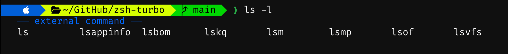

<p align="center">
  
</p>

<h1 align="center">zsh-turbo</h1>

<p align="center">
  プロンプト、入力候補、ハイライト、補完をまとめた Rust 製 zsh 拡張
</p>

<!-- standard:badges:start -->
<h3 align="center">対応プラットフォーム</h3>

<p align="center">
  
  
</p>

<p align="center">
  <a href="https://github.com/owayo/zsh-turbo/actions/workflows/ci.yml"></a>
  <a href="https://github.com/owayo/zsh-turbo/releases/latest"></a>
  <a href="LICENSE"></a>
</p>

<p align="center">
  <a href="README.md">English</a> |
  <a href="README.ja.md">日本語</a>
</p>
<!-- standard:badges:end -->

---

プロンプト描画、入力候補、シンタックスハイライト、補完スタイリングを 1 つのバイナリにまとめています。zsh から呼び出して使います。



## 機能

- **4つのプロンプトスタイル**: Lean、Classic（パワーライン）、Rainbow、Pure。フォントレベルは4段階から選択可能
- **30以上のセグメント**: dir, git, virtualenv, kubecontext, aws, gcloud, terraform, docker, direnv, nix_shell, ssh, 各種言語バージョン, load, battery, disk_usage, ram, vi_mode, proxy, cpu_arch, root_indicator, dir_writable, ip 等
- **カスタムコマンドセグメント**: TUI または TOML で任意のセグメントを定義
- **並列セグメント実行**: `std::thread::scope` で全セグメントを同時実行
- **非同期オートサジェスト**: 履歴ベース（prefix / substring / fuzzy 戦略）
- **シンタックスハイライト**: コマンド、代入語、fd 複製（`2>&1`）を含むリダイレクト、パス、シェルのエスケープを考慮した glob、文字列、zsh 特殊パラメータを含む変数、改行によるコマンド区切りに対応
- **`$PATH` に沿った判定**: 空の要素を zsh と同じくカレントディレクトリとして扱い、その中の実行可能ファイルをコマンドとして認識
- **Transient プロンプト**: コマンド実行後に前のプロンプトを簡略化
- **Semantic Prompt Marker**: iTerm2 3.7 以上と Warp 向けに OSC 133 prompt marker を出力し、右プロンプトと継続プロンプト（`PS2`）の範囲も端末へ伝達
- **堅牢な zsh 連携**: 初期化、ウィジェット、`compinit` は `SH_GLOB` や `NO_UNSET` などのユーザシェルオプション下でも動作し、zsh バッファ由来の CLI 値は `-` 始まりも受け付ける
- **安全なプロンプト出力**: セグメント文字列の zsh プロンプト展開を防ぎ、端末制御文字を置換
- **対話型設定 TUI**: 全設定を編集できるタブ式エディタ（Prompt / Segments / Git / Suggest / Style / Custom / Shell）とライブプレビュー
- **`zsh-turbo install-font`**: MesloLGS NF を OS のユーザフォントディレクトリへインストール
- **`zsh-turbo doctor`**: ターミナル・フォント・ツール・設定の診断
- **補完スタイリング**: 大小文字無視、グループ化、キャッシュ、色分け、外部補完関数ディレクトリの追加

- **CLI 補完の登録**: TUI の「補完」で任意の CLI を追加し、ヘルプ・生成コマンド・補完ファイルから候補を作成。バイナリ更新時はバックグラウンドで再構築し、Tab はキャッシュを使います。[設定方法](docs/configuration.ja.md#cli-補完の登録)

## 動作環境

- **OS**: macOS、Linux
- **シェル**: zsh 5.4 以上
- **Rust**: 1.98 以上（ソースからビルドする場合、edition 2024。検証用のバージョンは `mise.toml` で固定）

## 対応ターミナル

| ターミナル | Nerd Font アイコンの設定 |
|---|---|
| Ghostty、cmux | 対応。アイコンが表示されない場合は MesloLGS NF を選択してください。 |
| [macOS 標準ターミナル](https://support.apple.com/ja-jp/guide/terminal/trmltxt/mac) | 使用中のプロファイルで **設定 → プロファイル → テキスト → フォント → 変更** から MesloLGS NF を選択してください。 |
| [iTerm2](https://iterm2.com/documentation-fonts.html) | 使用中のプロファイルで **Settings → Profiles → Text → Font** から MesloLGS NF を選択してください。 |

ターミナルのフォント設定と zsh-turbo の設定は別です。Nerd Font アイコンを使う場合は `zsh-turbo configure` の **Prompt → Font level** を **Nerd** にします。アイコンが `?` や四角で表示される場合は `zsh-turbo doctor` でサンプル文字を確認してください。そのほかの zsh 対応ターミナルでは、Nerd Font がなくても `unicode` または `ascii` を使えます。

## インストール

<!-- standard:install:start -->
### Homebrew (macOS/Linux)

```bash
brew install owayo/zsh-turbo/zsh-turbo
```

### Cargo

Rust 1.98 以上が必要です。

```bash
cargo install --git https://github.com/owayo/zsh-turbo --locked
```

### GitHub Releases から

[Releases](https://github.com/owayo/zsh-turbo/releases/latest) から自分の環境のアーカイブを取得して展開し、`zsh-turbo` を `PATH` の通った場所に置きます。各リリースには、取得したファイルを確かめるための `SHA256SUMS` も添付しています。

| プラットフォーム | ファイル |
|---|---|
| Linux (x86_64) | `zsh-turbo-x86_64-unknown-linux-gnu.tar.gz` |
| Linux (ARM64) | `zsh-turbo-aarch64-unknown-linux-gnu.tar.gz` |
| macOS (Intel) | `zsh-turbo-x86_64-apple-darwin.tar.gz` |
| macOS (Apple Silicon) | `zsh-turbo-aarch64-apple-darwin.tar.gz` |

macOS でブラウザから取得した場合は、実行の前に隔離属性を外します: `xattr -d com.apple.quarantine zsh-turbo`。

### ソースから

[mise](https://mise.jdx.dev/) が必要です (Rust のツールチェーンは `mise.toml` で固定しています)。

```bash
git clone https://github.com/owayo/zsh-turbo.git
cd zsh-turbo
make install
```

`make install` は `/usr/local/bin` に入れます。場所を変えるときは `INSTALL_PATH` を指定します (例: `make install INSTALL_PATH="$HOME/.local/bin"`)。
<!-- standard:install:end -->


## 使い方

```bash
# 対話型設定 TUI
zsh-turbo configure

# ~/.zshrc に追加
eval "$(zsh-turbo init)"
```

[zsh-completions](https://github.com/zsh-users/zsh-completions) の補完定義を使う例です。まず一度リポジトリを取得します。

```bash
git clone https://github.com/zsh-users/zsh-completions.git "$HOME/.zsh/zsh-completions"
```

`~/.zshrc` に補完定義がある `src` ディレクトリを指定し、zsh-turbo を初期化します。複数の補完ディレクトリは `:` 区切りで指定できます。

```bash
export ZSH_TURBO_COMPLETION_DIRS="$HOME/.zsh/zsh-completions/src"
eval "$(zsh-turbo init)"
```

端末の shell integration は iTerm2 3.7 以上と Warp で自動的に有効になります。OSC 133 marker でプロンプト範囲を囲むため、端末側のコマンド範囲抽出で左プロンプト、右プロンプト、継続プロンプトを除外できます。無効化する場合は初期化前に `ZSH_TURBO_TERM_SHELL_INTEGRATION=0`、強制有効化する場合は `1` を設定してください。

## プロンプトスタイル

| スタイル | 説明                                                   |
| -------- | ------------------------------------------------------ |
| Lean     | 背景色なし、ミニマル                                   |
| Classic  | Powerline セパレータ + 背景色付きセグメント            |
| Rainbow  | セグメントごとにカラーパレットを巡回                   |
| Pure     | ディレクトリ + git のみのミニマル構成                   |

`zsh-turbo configure` の **配色 → Rainbow の配色** で、青系・緑系・オーシャン・サンセット・パステル・モノクロなど14種類を選べます。**プロンプト → コマンド入力位置** では、同じ行／次の行を切り替えられます。配色は隣接するブロックの色相・明暗に差をつけ、文字を読みやすく調整しています。**配色 → Rainbow のブロック** では OS・ディレクトリ・Git・カスタムの各ブロックを選び、文字色と背景色を256色パレットや RGB 値で個別指定できます。並べ替えや配色セットの変更後も個別色は保持され、プレビューにも反映されます。色選択中も上部に全ブロックのプレビューが表示され、選択中の色や RGB 入力が即座に反映されます。**プロンプト → プロンプト間の空行** では、Enter 後の間隔を0〜10行で指定できます。`S` で保存、`Esc` で終了します。未保存の変更を破棄して終了する場合は、もう一度 `Esc` を押してください。

## キーバインド

| キー        | 動作                         |
| ----------- | ---------------------------- |
| 右矢印      | サジェストをパスの一階層または次の単語まで受け入れ |
| Alt+F       | 1単語を受け入れ              |
| Ctrl+右矢印 | 1単語を受け入れ              |
| 上矢印      | 履歴検索（prefix）           |
| 下矢印      | 履歴検索（prefix）           |
| Ctrl+R      | 履歴候補の一覧（曖昧検索）   |
| Tab         | サジェスト全体を受け入れ（候補がないときは通常の補完） |

サジェストはカーソルがバッファ末尾にある間だけ表示・受理されます。カーソルを既存文字列内へ移動すると ghost 表示を消し、末尾へ戻ると有効な候補を再表示します。
たとえば `ls -l` に `/path/to/hoge/fuga` が表示されたとき、右矢印を押すたびに `/path`、`/path/to`、`/path/to/hoge` の順に採用できます。Tab は候補全体を採用します。これらのキーと Alt+F・Ctrl+右矢印の動作は `zsh-turbo configure` の「入力候補」で個別に変更できます。変更後はシェルを再起動してください。

一致度が同程度の候補は使用頻度、新しさの順に並べます。`Ctrl+R` は入力中の文字列から履歴候補を検索し、空欄なら全履歴を対象にします。上下キー・Tab で選び、Enter で入力欄に戻し、もう一度 Enter で実行します。Esc / Ctrl+C で取り消すと元の入力とカーソル位置に戻ります。候補数は「入力候補 → 候補の最大数」で指定でき、既定は10件です。

履歴全体で前方一致を部分一致・曖昧一致より優先します。追記途中の最終行と複数行コマンドの断片は、64 KiB の読み取り境界にあるものも候補から除外します。表示する上位候補だけを選び、全候補の並べ替えを省いています。

履歴候補が表示されていないときは、`zsh-turbo conf<Tab>` や `zsh-turbo install-font --fo<Tab>` も補完できます。CLI定義から補完を生成するため、サブコマンド・オプションの追加に追従します。ほかのコマンドはzsh標準と `fpath` の補完を利用します。入力の消去・確定時には古い候補の受信を解除し、通常のコマンドのエラー出力を保持します。左右のプロンプトは1回のCLI起動でまとめて描画します。

更新前のシェルですでにエラー出力が見えなくなっている場合は、`exec zsh 2>/dev/tty` で標準エラーを端末へ戻して再起動してください。

## コマンド

```bash
zsh-turbo configure                       # 対話型設定 TUI
zsh-turbo init                            # zsh 初期化スクリプト出力
zsh-turbo prompt --side left              # プロンプト描画
zsh-turbo suggest "クエリ"                # サジェスト取得（prefix）
zsh-turbo suggest "qry" --strategy fuzzy  # ファジーサジェスト
zsh-turbo complete "prefix"               # 補完候補一覧
zsh-turbo highlight "FOO=bar echo 2>&1"   # シンタックスハイライト
zsh-turbo install-font                    # MesloLGS NF をインストール（--force で上書き）
zsh-turbo doctor                          # 環境診断
```

設定 TUI は日本語環境なら日本語、それ以外では英語で表示します。`LC_ALL` → `LC_MESSAGES` → `LANG` の順に最初の空でない値を採用し、`C`・`POSIX` ロケールなら英語に固定します。それ以外では、`LANGUAGE` の `:` 区切りリストで最初に見つかった対応言語を優先します。言語設定がなければ英語です。一時的に英語で開くには `LC_ALL=C zsh-turbo configure` を実行してください。保存する設定のキーと値は、表示言語によらず共通です。

### Nerd Font のインストール

`zsh-turbo install-font` は MesloLGS NF を、`curl` で OS のユーザフォントディレクトリにダウンロードします。

- macOS: `~/Library/Fonts/`
- Linux: `~/.local/share/fonts/`（インストール後に `fc-cache` を自動実行）

事前の書き込み確認には排他的に作成する一意なプローブファイルを使い、同名の既存ファイルを切り詰めたり削除したりしません。ダウンロードにも個別に予約した一時ファイルを使うため、複数のインストール処理が互いのダウンロード途中のファイルを削除・置換しません。

フォントの取得元は確認済みのコミットに固定しています。フォント取得前に、配布元の著作権表示と Apache-2.0 の全文を `MesloLGS NF License.txt` として同じディレクトリへ保存します。フォントがすべてインストール済みでも、再実行するとライセンス文書を補完します。この文書はフォントのインストール／スキップ件数には含めません。

インストール後は、使用中のターミナルのプロファイルで **MesloLGS NF** を選び、新しいターミナルセッションを開いてください。フォントのインストールだけではターミナルのフォント設定は変わりません。標準ターミナルと iTerm2 の設定場所は[対応ターミナル](#対応ターミナル)を参照してください。

## 設定

設定ファイル: `XDG_CONFIG_HOME` が空でない場合は `${XDG_CONFIG_HOME}/zsh-turbo/config.toml`、未設定または空の場合は `~/.config/zsh-turbo/config.toml`

設定の保存はアトミックに置換します。並行保存では排他的に作成した別々の一時ファイルを使うため、書き込み途中のデータを別の保存処理が上書きしません。

`zsh-turbo configure` で以下のすべての設定を編集できます。設定ファイルを直接編集しても構いません。TUI は読み込んだ設定を編集し、`S` で同じファイルへ保存します。

全設定、TUI の操作、配色とセグメントの一覧は[設定リファレンス](docs/configuration.ja.md)を参照してください。

## 開発

<!-- standard:dev:start -->
[mise](https://mise.jdx.dev/) が必要です。ツールの版は `mise.toml` で固定しています。

```bash
make setup   # ツールチェーン (mise) と依存を取得する
make ci      # CI と同じ検査 (書き換えない)
```

| コマンド | 説明 |
|---|---|
| `make setup` | ツールチェーン (mise) と依存を取得する |
| `make build` | デバッグ版をビルドする |
| `make release` | リリース版をビルドする |
| `make run` | デバッグ版を実行する (引数は ARGS="...") |
| `make test` | テストを実行する |
| `make lint` | clippy を警告ゼロで通す |
| `make fmt` | コードを整形する (書き換える) |
| `make fmt-check` | 整形済みかを確かめる (書き換えない) |
| `make check` | 整形と静的検査 (書き換えない) |
| `make ci` | CI と同じ検査 (書き換えない) |
| `make install` | リリース版を INSTALL_PATH (既定 /usr/local/bin) に入れる |
| `make uninstall` | INSTALL_PATH から取り除く |
| `make clean` | ビルド成果物を消す |

`make` でターゲットの一覧を表示します。リリースは GitHub Actions で行います (**Actions → Release → Run workflow**)。
<!-- standard:dev:end -->

配布アーカイブとライセンス文書の生成・検証は[開発ガイド](docs/development.ja.md)にまとめています。

## ライセンス

<!-- standard:license:start -->
[MIT](LICENSE)
<!-- standard:license:end -->

依存ライブラリにはそれぞれのライセンスが適用されます。著作権表示、ライセンス全文、使用バージョンのソース入手先は [THIRD_PARTY_NOTICES.md](THIRD_PARTY_NOTICES.md) にまとめています。

`option-ext` は MPL-2.0 のもとで無改変で使用しています。対象ソースは上記文書のリンク先で MPL-2.0 として入手でき、本体の MIT ライセンスとは別に扱います。別途ダウンロードする MesloLGS NF フォントにも、独自の [Apache-2.0 の表示と条文](licenses/MesloLGS-NF.txt)が適用されます。
